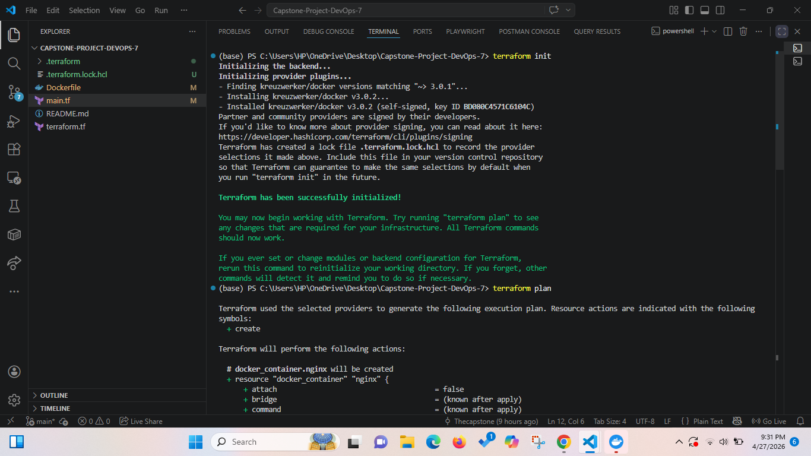
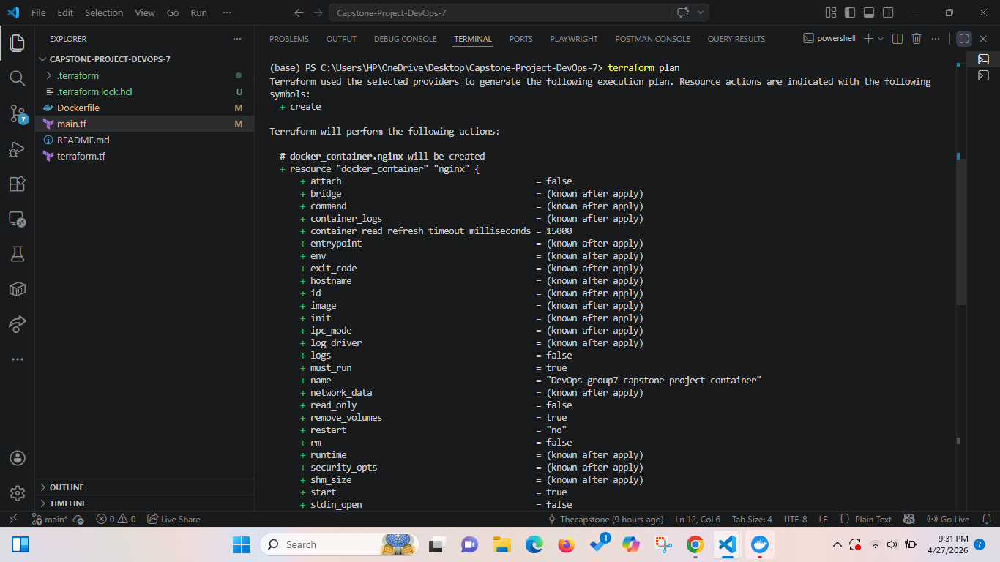
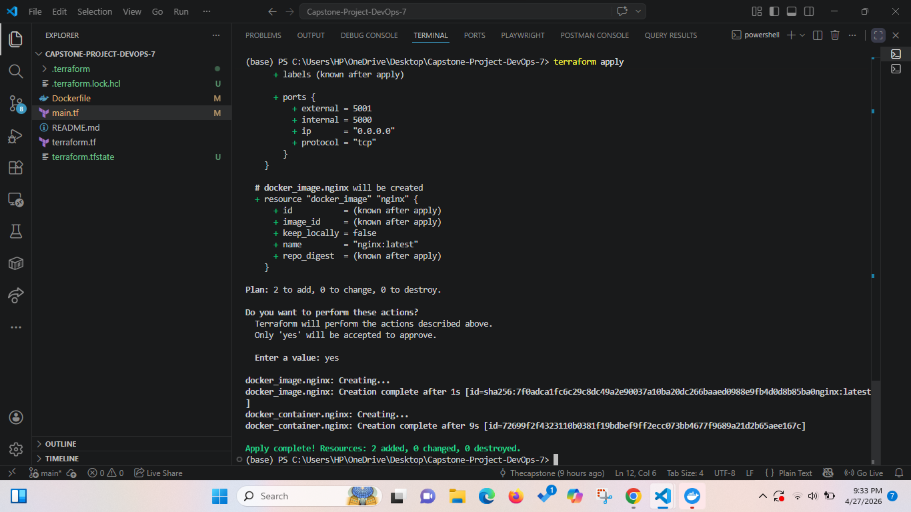
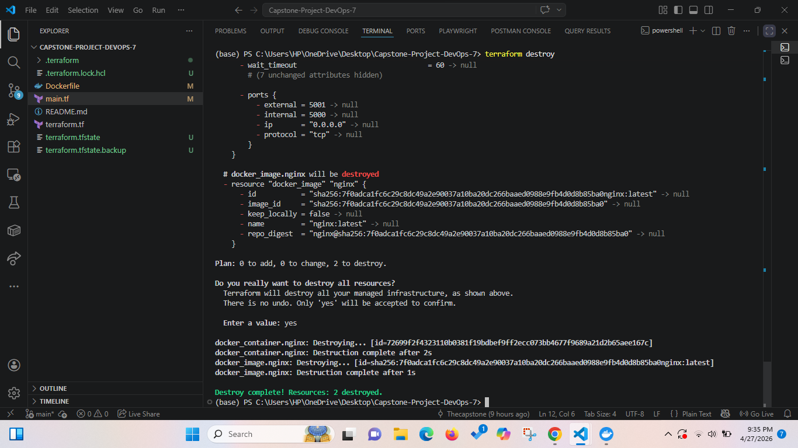
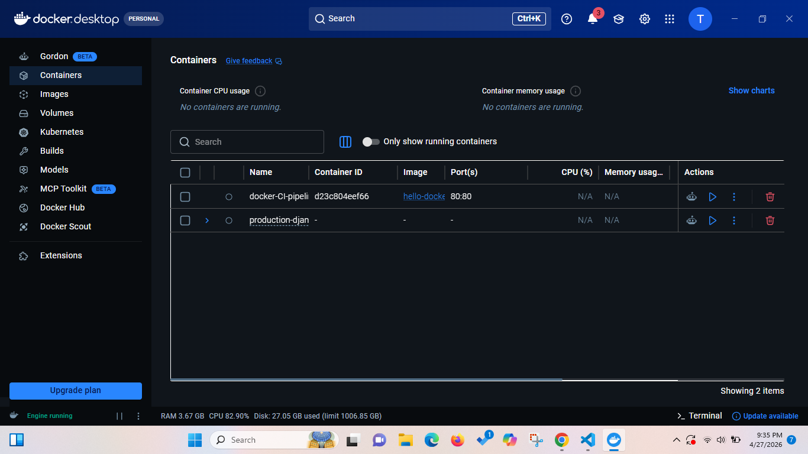

# DevOps Capstone Project Group 7

## Provisioning and Managing a Local Docker Container Using Terraform

---

## Table of Contents

- [Project Overview](#project-overview)
- [Prerequisites](#prerequisites)
- [Project Structure](#project-structure)
- [Configuration Files](#configuration-files)
- [Workflow](#workflow)
  - [1. Initialize Terraform](#1-initialize-terraform)
  - [2. Plan the Infrastructure](#2-plan-the-infrastructure)
  - [3. Apply the Configuration](#3-apply-the-configuration)
  - [4. Verify Container in Docker Desktop](#4-verify-container-in-docker-desktop)
  - [5. Destroy the Infrastructure](#5-destroy-the-infrastructure)
  - [6. Verify Removal in Docker Desktop](#6-verify-removal-in-docker-desktop)
- [Final Observations](#final-observations)
- [Team](#team)

---

## Project Overview

This project demonstrates how to provision and manage a local Docker container using **Terraform** as an Infrastructure as Code (IaC) tool. The goal is to showcase how Terraform can be used beyond cloud environments applying the same declarative workflow to manage local containerized resources with consistency, visibility, and control.

**Completed Deliverables:**

- [x] Provisioned Docker container using Terraform
- [x] Defined container and provider parameters in `main.tf` and `terraform.tf` respectively
- [x] Initialized Terraform
- [x] Ran Terraform plan to inspect resources set to be provisioned
- [x] Ran Terraform apply to apply all changes
- [x] Confirmed container creation in Docker Desktop
- [x] Ran Terraform destroy to clean up resources
- [x] Confirmed removal of Docker container in Docker Desktop

---

## Prerequisites

Ensure the following tools are installed and running before proceeding:

| Tool | Purpose |
|---|---|
| [Docker Desktop](https://www.docker.com/products/docker-desktop/) | Container runtime environment |
| [Terraform](https://developer.hashicorp.com/terraform/install) | Infrastructure provisioning tool |
| WSL / Ubuntu (optional) | Linux-based terminal environment |

---

## Project Structure

```
group7-capstone/
├── images/
│   ├── G7-terraform-init.png
│   ├── G7-terraform-plan.png
│   ├── G7-Terraform-apply.png
│   ├── G7-Terraform-destroy.png
│   └── G7-Docker-container-destroyed.png
├── main.tf          # Defines the Docker container resource
├── terraform.tf     # Configures the Terraform provider (Docker)
└── README.md        # Project documentation
```

---

## Configuration Files

### `terraform.tf`: Provider Configuration

Defines the required provider for managing Docker resources via Terraform.

```hcl
terraform {
  required_providers {
    docker = {
      source  = "kreuzwerker/docker"
      version = "~> 3.0.1"
    }
  }
}

provider "docker" {
  host = "npipe:////.//pipe//docker_engine"
}
```

### `main.tf`- Container Resource Definition

Specifies the Docker image and container parameters to be provisioned.

```hcl
resource "docker_image" "nginx" {
	name         = "nginx:latest"
	keep_locally = false
}

resource "docker_container" "nginx" {
	image = docker_image.nginx.image_id
	name = "DevOps-group7-capstone-project-container"
	ports {
		internal = 5000
		external = 5001
	}
}

```

---

## Workflow

### 1. Initialize Terraform

Downloads the required provider plugins and prepares the working directory.

```bash
terraform init
```

**Expected output:** Terraform downloads the Docker provider and confirms successful initialization.



---

### 2. Plan the Infrastructure

Generates an execution plan showing exactly which resources will be created, modified, or destroyed — without making any actual changes.

```bash
terraform plan
```

**Expected output:** A detailed preview of the Docker image and container resources to be provisioned.



---

### 3. Apply the Configuration

Provisions the Docker container as defined in `main.tf`, prompting for confirmation before executing.

```bash
terraform apply
```

Type `yes` when prompted to confirm. Terraform will pull the image and start the container.

**Expected output:** Confirmation that the container has been created successfully.



---

### 4. Verify Container in Docker Desktop

After `terraform apply` completes, open **Docker Desktop** to confirm the container is running. You should see the container listed under the **Containers** tab with a status of `Running`.


---

### 5. Destroy the Infrastructure

Tears down all resources managed by Terraform in this configuration stopping and removing the container and image.

```bash
terraform destroy
```

Type `yes` when prompted to confirm.

**Expected output:** Terraform confirms all resources have been destroyed.



---

### 6. Verify Removal in Docker Desktop

Return to **Docker Desktop** and confirm that the container no longer appears in the **Containers** tab, validating that the cleanup was successful.



---

## Final Observations

Working through this project highlighted several practical benefits of using Terraform for container management:

- **Simplified provisioning**: Terraform abstracted the complexity of manually running `docker pull` and `docker run` commands, replacing them with a single declarative configuration.
- **Change visibility** - The `terraform plan` step provided a clear, reviewable preview of all proposed changes before they were applied, reducing the risk of unintended modifications.
- **Clean teardown** - `terraform destroy` reliably removed both the container and image in a single command, eliminating the need for manual cleanup steps.

---

## Team

**Group 7** - DevOps Capstone Project
